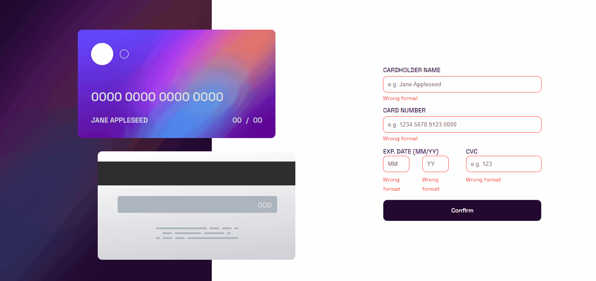
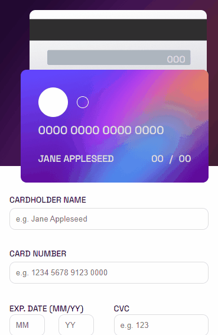

# Desafio Cartão Interativo - Frontend-Mentor

Este é um desafio de um cartão interativo, proposto pelo site Frontend-Mentor.

## Tabela de Conteúdos

- [Visão Geral](#visão-geral)
    - [Imagens](#imagens)
    - [Link da página](#link)
- [Processo](#processo)
    - [Linguagens utilizadas](#linguagens-utilizadas)
    - [O que aprendi](#o-que-aprendi)
    - [Possíveis evoluções](#possíveis-evoluções)
- [Autor](#autor)

## Visão-geral

### Imagens

<br>

````
Versão de Desktop
````

   

<br>

````
Versão Mobile
````

 

### Link

- Página no GitHub Pages: <a href="https://julio-mansan2.github.io/cartao-interativo/">Clique aqui!</a>

## Processo

### Linguagens utilizadas

<br>

- Marcações semânticas de HTML5
- Propriedades de customização do CSS3
- Estruturas em JavaScript

<br>

### O que aprendi

<br>

- Transferir o conteúdo de um input para o próprio HTML:

````html

<h1 class="number">0000&nbsp0000&nbsp0000&nbsp0000</h1>

<label for="number">Card number</label>
<input type="text" class="input" required name="number" id= "number" maxlength="19" placeholder="e.g. 1234 5678 9123 0000" id="number" oninput="this.value = this.value.replace(/[^0-9.]/g, '').replace(/(\..*?)\..*/g, '$1');" >

````
````javascript

inputNumber.addEventListener('input', (e) => {
    let inputValue = e.target.value;
    inputNumber.value = inputValue.replace(/\s/g, '').replace(/([0-9]{4})/g, '$1 ').trim();

    if (inputNumber.value == '') {
        number.innerText = '0000 0000 0000 0000';
    } else {
        number.innerText = inputNumber.value;
    }
});


````
<br>

- Permitir apenas números dentro de um input text:

````html

<input type="text" class="input" required name="number" id= "number" maxlength="19" placeholder="e.g. 1234 5678 9123 0000" id="number" oninput="this.value = this.value.replace(/[^0-9.]/g, '').replace(/(\..*?)\..*/g, '$1');" >

````

### Possíveis evoluções

<br>

- Códigos mais compactos;
- Posicionar melhor os elementos;
- Utilizar menor quantidade de posicionamentos manuais.

<br>

## Autor

GitHub - <a href="https://github.com/julio-mansan2">julio-mansan2</a> <br>
Front-end Mentor - <a href="https://www.frontendmentor.io/profile/julio-mansan2">julio-mansan2</a> <br>
LinkedIn - <a href="https://www.linkedin.com/in/j%C3%BAlio-a-mansan-3415a7249/">Júlio A.</a> <br>